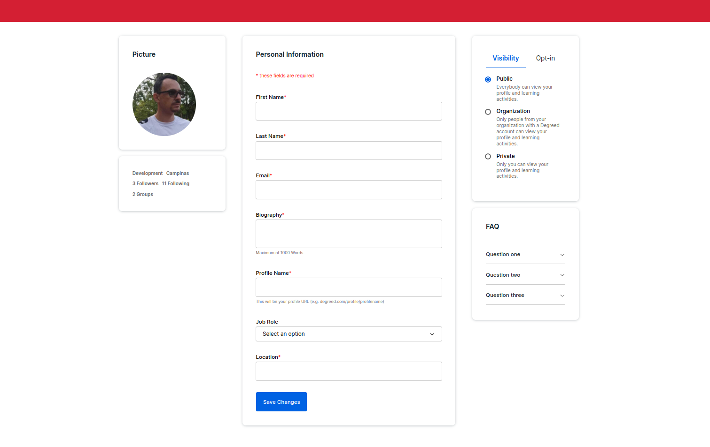

This is a [Next.js](https://nextjs.org/) project bootstrapped with [`create-next-app`](https://github.com/vercel/next.js/tree/canary/packages/create-next-app).

## Purpose

This project has been created with the goal to practice the following technologies:

- [Radix UI](https://www.radix-ui.com/primitives) - set of primitive building blocks to design a project UI.
- [Panda](https://panda-css.com/) - CSS Library that provides styling solution for modern web browsers.

### Challenge

After reading the documentation about Radix UI and Panda CSS, I developed this layout simulating a profile editing screen:



## Setup

To install all project dependencies, run this command:

```bash
npm i
```

## Run

To run the project, run the following command:

```bash
npm run dev
```

Open [http://localhost:3000](http://localhost:3000) with your browser to see the result.

## Learn More

To learn more about Next.js, take a look at the following resources:

- [Next.js Documentation](https://nextjs.org/docs) - learn about Next.js features and API.
- [Learn Next.js](https://nextjs.org/learn) - an interactive Next.js tutorial.

You can check out [the Next.js GitHub repository](https://github.com/vercel/next.js/) - your feedback and contributions are welcome!
